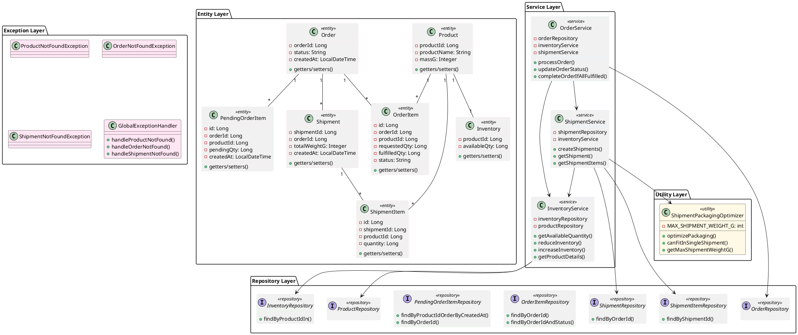
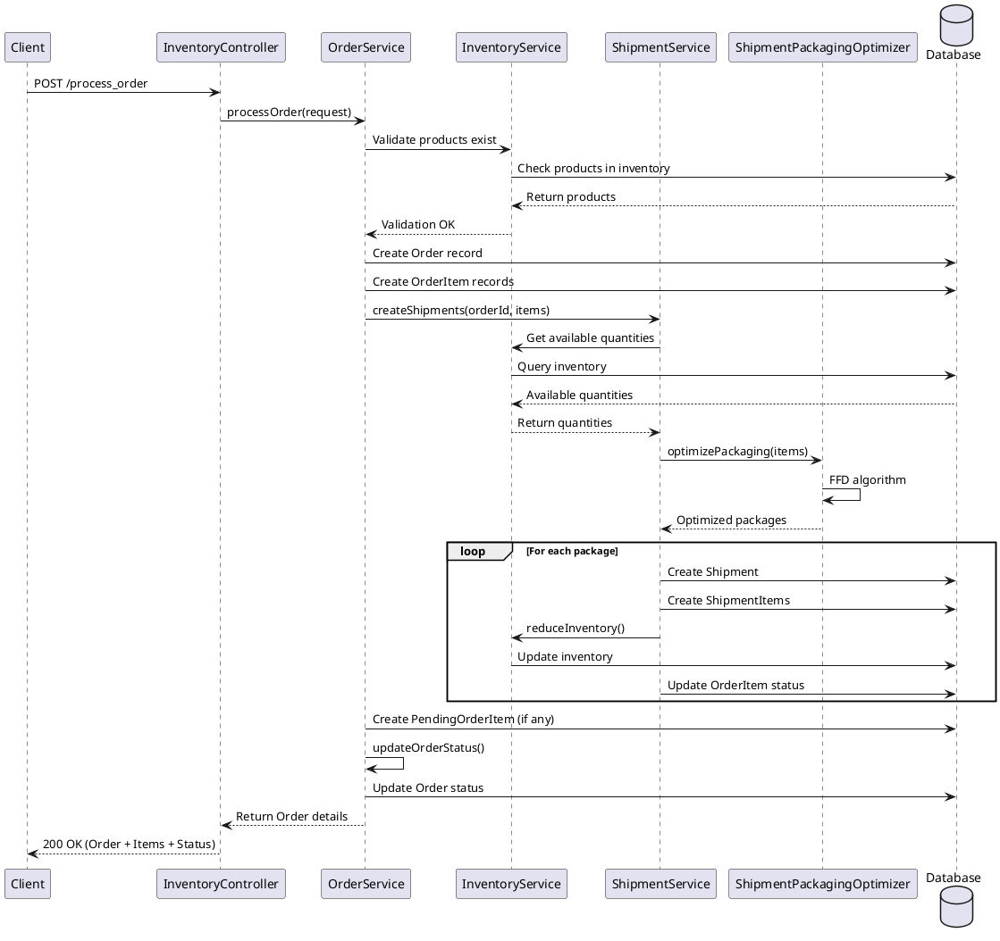
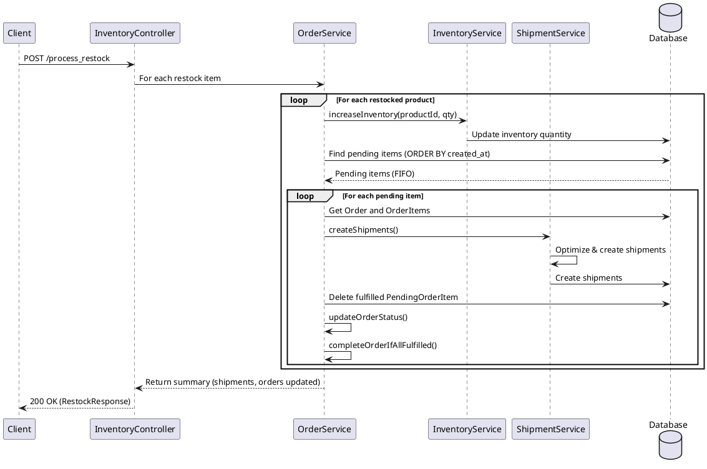
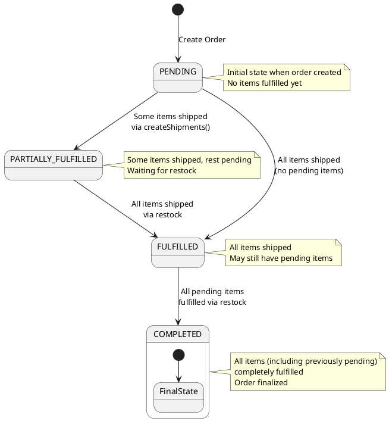
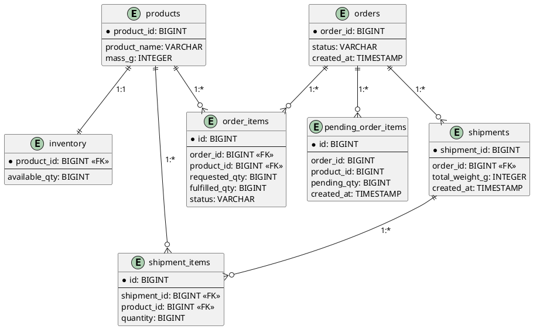
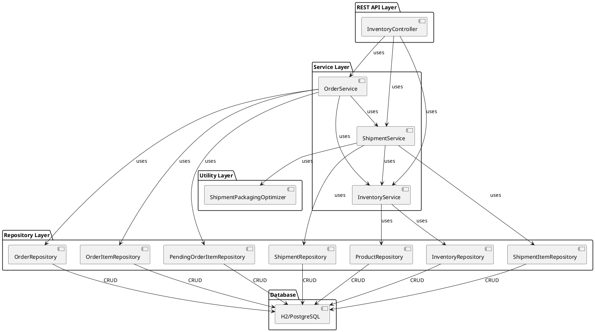
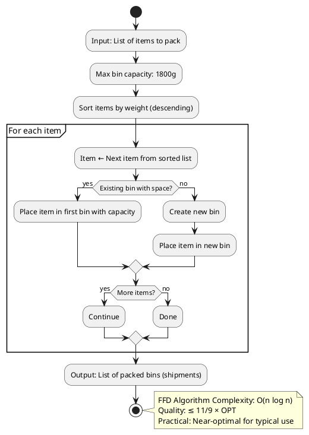

# System Diagrams (PlantUML Format)

This file contains PlantUML diagrams that can be rendered using:
- PlantUML online editor: https://www.plantuml.com/plantuml/uml
- VS Code PlantUML extension
- Any PlantUML-compatible tool

## 1. Class Diagram



## 2. Sequence Diagram - Process Order



## 3. Sequence Diagram - Process Restock



## 4. State Diagram - Order Status Transitions



## 5. Entity Relationship Diagram



## 6. Component Diagram - System Architecture



## 7. Activity Diagram - FFD Bin Packing Algorithm



## How to Use These Diagrams

### Option 1: PlantUML Online Editor
1. Go to https://www.plantuml.com/plantuml/uml
2. Copy and paste any diagram code
3. Click "Submit"
4. View rendered diagram

### Option 2: VS Code
1. Install "PlantUML" extension
2. Create `.puml` files with diagram code
3. Preview with Alt+D

### Option 3: Documentation
Include diagram references in markdown:
```markdown

```

## Diagram Legend

- **🟥 Red**: Entity/Database tables
- **🟦 Blue**: Service layer (business logic)
- **🟩 Green**: Repository layer (data access)
- **🟨 Yellow**: Utility/Helper classes
- **🟪 Purple**: Exception handling
- **→**: Dependency/Relationship
- **--o{**: One-to-many relationship
- **--||**: One-to-one relationship

---

**Diagrams Generated:** December 25, 2025  
**Format:** PlantUML  
**Status:** Ready for rendering
